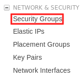

# Procedimento para provisionar a infraestrutura do Sistema de Preditores

## Boas práticas

Este procedimento vai destacar como provisionar um ambiente com boas práticas de infraestrutura, tendo em vista que atualmente não há automação de todo processo, que possa garantir a segurança dos dados.

Observação: este processo não isenta a necessidade de backup dos dados

## RDS - Relational Database Service

### Criação de instância de RDS PostgreSQL 9.6.6

* Atualmente uma instância **db.t2.micro** é suficiente para suportar a carga do sistema
* Utilize o mínimo de 10 GB de disco
* Não é necessário criar *Multi-AZ deployment*
* Defina as informações do banco:
  * Identificador da instância
  * Usuário
  * Senha

### Configuração do RDS

Após a criação, faça a configuração do **Security Group** do RDS.

> Veja os procedimentos de [Security Group](#security-group) caso ainda não exista um Security Group que defina as regras de acesso dos servidores.

1. Acesse o *Security Group* do RDS
1. Vá na aba **Inbound**
1. Clique em **Edit**
1. Clique em **Add Rule**
    * Defina a opção *Type* como **PostgreSQL**
1. Procure pelo nome que definiu para o *Security Group* dos servidores e clique sobre ele
    * Caso ainda não tenha criado, veja a seção [Security Group](#security-group)
1. Clique em **Save**

## Security Group (servidores de aplicação)

A criação de métricas de acesso de rede para garantir a segurança e comunicação dos serviços para ser o elo de que vai interligar os sistema.

1. Acesse **EC2**
1. No menu lateral esquerdo, vá até a seção **NETWORK & SECURITY**
1. Clique em **Security Groups**

1. Crie um novo Security Group
    * Defina as informações solicitadas
    * Group name
    * Description
    * VPC (pode deixar no modelo padrão)
1. Adicione duas regras de acesso
    * Defina a opção *Type* como **HTTP** e a outra como **HTTPS**
1. Clique em **Save**

## Criação de ambiente (servidores de aplicação)

### Criando a estrutura básica

1. Acesse **Elastic Beanstalk**
1. Clique em **Actions**
1. Clique em **Create enviorment**
1. Selecione **Web server environment**
1. Clique em **Select**

### Adicionando informações do ambiente

1. Informe o nome do ambiente - será o nome da instância *EC2*
1. Informe o domínio (opcional)
1. Informe a descrição (opcional)