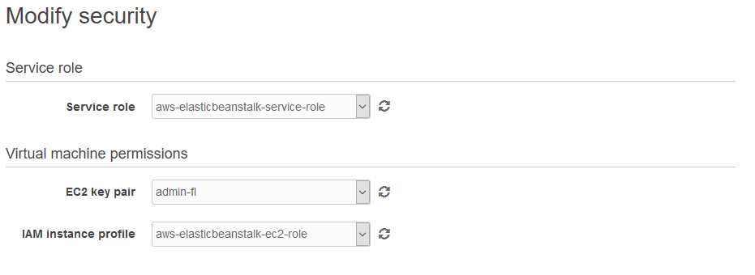

# Procedimento para provisionar a infraestrutura do Sistema de Preditores

## Boas práticas

Este procedimento vai destacar como provisionar um ambiente com boas práticas de infraestrutura, tendo em vista que atualmente não há automação de todo processo, que possa garantir a segurança dos dados.

Observação: este processo não isenta a necessidade de backup dos dados

## RDS - Relational Database Service

### Criação de instância de RDS PostgreSQL 9.6.6

* Atualmente uma instância **db.t2.micro** é suficiente para suportar a carga do sistema
* Utilize o mínimo de 10 GB de disco
* Não é necessário criar *Multi-AZ deployment*
* Defina as informações do banco:
  * Identificador da instância
  * Usuário
  * Senha

### Configuração do RDS

Após a criação, faça a configuração do **Security Group** do RDS.

> Veja os procedimentos de [Security Group](#security-group) caso ainda não exista um Security Group que defina as regras de acesso dos servidores.

1. Acesse o *Security Group* do RDS
1. Vá na aba **Inbound**
1. Clique em **Edit**
1. Clique em **Add Rule**
    * Defina a opção *Type* como **PostgreSQL**
1. Procure pelo nome que definiu para o *Security Group* dos servidores e clique sobre ele
    * Caso ainda não tenha criado, veja a seção [Security Group](#security-group)
1. Clique em **Save**

## Security Group

A criação de métricas de acesso de rede para garantir a segurança e comunicação dos serviços para ser o elo de que vai interligar os sistema.

1. Acesse **EC2**
1. No menu lateral esquerdo, vá até a seção **NETWORK & SECURITY**
1. Clique em **Security Groups**

1. Crie um novo Security Group
    * Defina as informações solicitadas
    * Group name
    * Description
    * VPC (pode deixar no modelo padrão)
1. Adicione duas regras de acesso
    * Defina a opção *Type* como **HTTP** e a outra como **HTTPS**
1. Clique em **Save**

## Criação de ambiente (servidores de aplicação)

### Criando a estrutura básica

1. Acesse **Elastic Beanstalk**
1. Clique em **Actions**
1. Clique em **Create enviorment**
1. Selecione **Web server environment**
1. Clique em **Select**

### Environment information

1. Defina o nome do ambiente em **Environment name** - será o nome da instância *EC2*
    * *Domain* e *Description* são opcionais

### Base configuration

1. Selecione **Preconfigured platform**
1. Abra a lista suspensa e escolha por *Ruby*
1. Selecione **Existing version** ou **Upload your code** em **Application code**
1. Selecione pela versão desejada
1. Clique no botão **Configure more options**

> Se selecionar a opção **Upload your code**, siga os passos em [Atualize a aplicação com a versão de código desejada](#atualize-a-aplicação-com-a-versão-de-código-desejada)

### Configure more options

Nesta seão serão apresentadas as demais configurações para habilitar o funcionamento do ambiente. Teremos a seções:

* Software
* Instances
* Capacity
* Load balancer
* Rolling updates and deployments
* Security
* Monitoring
* Notifications
* Network
* Database
* Tags

Para todas elas, clique em **Modify** abaixo, para que possam ser configuradas.

#### Geral (IMPORTANTE)

1. Selecione o tipo de uso como **Custom configuration**
1. Clique em **Change platform configuration**
1. Na lista suspensa, selecione **Puma with Ruby 2.4 running on 64bit Amazozn Linux/2.6.0**

> Durante os testes, foi encontrado um bug com a versão 2.5 do Ruby, inteferindo na criação do ambiente, devido a isto deve ser utilizado o Ruby 2.4.

#### Software

Configure as variáveis de ambiente para que o sistema possa funcionar. Estas variáveis de ambiente serão configuradas a cada vez que o ambiente foi iniciado. Caso alguma seja alterada, será realizada a configuração no ambiente.

Os valores sempre vão ser compostos por *chave* e *valor*. Não esqueça de adicionar as chaves de acesso ao RDS, criado na seção [RDS - Relational Database Service](#rds-relational-database-service), com as chaves:
* RDS_DB_NAME
* RDS_HOSTNAME
* RDS_PASSWORD
* RDS_PORT
* RDS_USERNAME

> Se o ambiente precisar ser reconstruído devido a alguma alteração necessária, não se esqueça de buscar as configurações do que será substituído.

#### Security

Apenas altere a opção **EC2 key pair** com a chave que será utilizada

> O padrão atual de chave é **admin-fl**

#### Instances

1. Selecione o tamanho para o ambiente
    * Produção: mínimo **t2.small**
    * Staging: mínimo **t2.micro**
1. A opção **AMI ID** é opcional, gerado automaticamente
1. Nas opções de **Root volume (boot device)** podem ser mantidas como **(Container default)**
1. A seção **EC2 security groups** é como os sistemas vão se comunicar. Selecione o grupo criado no processo [Security Group](#security-group)
    * 
1. Clique em **Save**

#### Database (ATENÇÃO)

Na configuração de database, não selecione nenhuma opção, deixe como está, pois isto será garantido pela configuração de variáveis de ambiente, criado na seção [Software](#software).

## Atualize a aplicação com a versão de código desejada

1. Compacte os arquivos e diretórios da raiz do repositório, que fazem referência ao projeto em si.
    * Não inclua os diretórios `.git` e `infra-provisioning`
    * Não inclua o arquivo `.gitignore`

Se quiser um processo através de código:
1. Clone o respotiório: `git clone git@github.com:FundacaoLemann/sistema-preditores.git`
1. Execute a compactação sem incluir os diretórios e arquivos desnecessários: `zip preditores.zip -r sistema-preditores/ -x "sistema-preditores/.git/*" -x "sistema-preditores/.gitignore" -x "sistema-preditores/infra-provisioning/*"`

> Descrição do comando ZIP:
> * **zip** - binário para executar o comando
> * **preditores.zip** - arquivo que será gerado da compactação
> * **-r sistema-preditores/** - comando para recursividade com o diretório para compactação
> * **-x "sistema-preditores/.git/*"** - não compacta o diretório e seus arquivos
> * **-x "sistema-preditores/.gitignore"** - não compacta o arquivo *.gitignore*
> * **-x "sistema-preditores/infra-provisioning/*"** - não compacta o diretório e seus arquivos